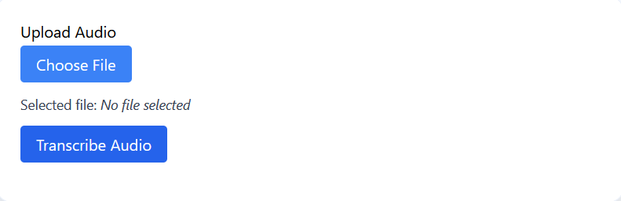
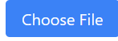
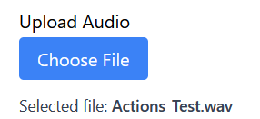
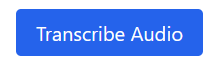
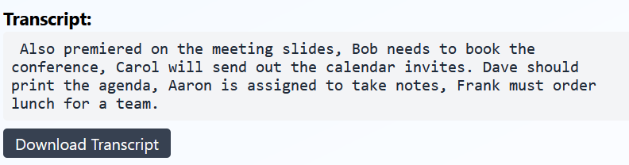
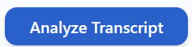
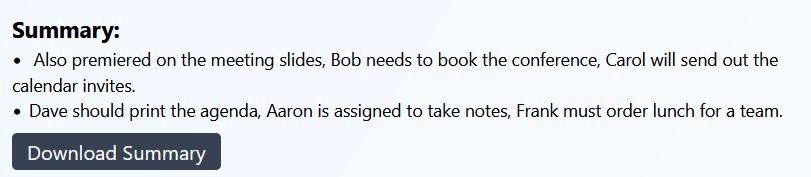
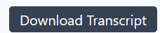
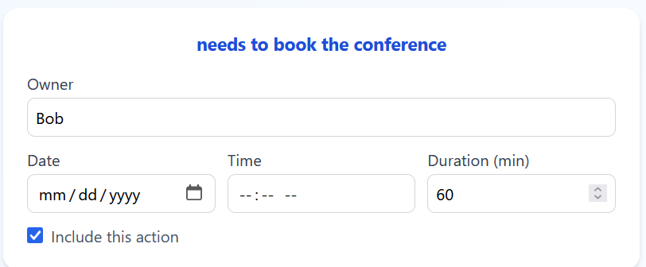

# AI Meeting Summarizer User Guide

Welcome to the AI Meeting Summarizer!
This web application helps you transcribe meeting audio, extract and schedule action items, and organize follow-up—all in one place.

## Getting Started

### 1. Open the App
- The backend server must be running first. 
- /backend folder and running 'python run.py' if you are self-hosting
- Run the App by going to /frontend folder and running 'npm start'
- Open your browser and go to `http://localhost:3000` (or your deployed app URL).

## Step 1: Upload Meeting Audio
**Screenshot: “Upload Audio” Section**

- **Click “Choose File”**
  
  Select your meeting recording (WAV, MP3, or supported format).
- **See “Selected file”**
  The file name will display under the button.
  
- **Click “Transcribe Audio”**
  
  Wait for the app to process your audio.

## Step 2: View Transcript and Summary
**Screenshot: “Transcript” and “Summary” Sections**

**Click "Analyze Transcript**

Summary Panel and Action Items appear

- **Transcript**
  Shows the full transcribed text.
- **Summary**
  Key points extracted by the AI.

- **Download Output**
  Click “Download Transcript” or “Download Summary” to save the results as `.txt` files.

## Step 3: Review Actions and Schedule
**Screenshot: “Review and Schedule Actions”**

- **Action Items**
  All detected action items are shown in easy-to-read cards.

- **Set Owner, Date, and Time**
  Edit the person responsible, pick a date, and set a time for each task.
- **Select Actions to Schedule**
  Use the checkboxes to include or exclude actions.
- **Click “Schedule Selected”**
  Sends your chosen actions to Nextcloud Calendar.

## Step 4: Connect to Nextcloud
**Screenshot: “Connect to Nextcloud” Button**

- Click to authorize with Nextcloud.
- You must be connected for calendar scheduling to work.

## Dark Mode
**Screenshot: “Dark Mode Toggle”**

- Use the moon/sun icon in the header.
- UI switches instantly for night-friendly readability.

## Troubleshooting

### Common Issues and Solutions

#### 1. “Error processing audio”
- **Cause:** File too large, unsupported format, or backend is down.
- **Fix:**
  - Use files under 25MB.
  - Try another audio format (WAV/MP3).
  - Check backend server logs.

#### 2. “Transcript is missing or invalid”
- **Cause:** Transcription failed.
- **Fix:**
  - Make sure the audio is clear.
  - Check backend logs for errors.
  - Try a different file.

#### 3. “Error scheduling events”
- **Cause:**
  - Not connected to Nextcloud.
  - Backend can’t reach calendar API.
  - Missing required fields (owner, date, or time).
- **Fix:**
  - Connect to Nextcloud using the button.
  - Check the event fields.
  - Review backend logs for more info.

#### 4. Buttons Not Responding
- **Cause:**
  - No file selected before “Transcribe Audio”.
  - Internet/browser issue.
- **Fix:**
  - Ensure file is chosen.
  - Refresh the page and try again.

#### 5. Nothing happens after clicking “Transcribe Audio” or “Schedule Selected”
- **Cause:**
  - Backend not running or CORS error.
- **Fix:**
  - Ensure backend server is up (`run.py` running).
  - Check browser console for CORS or network errors.

#### 6. UI Glitches or Text is Hard to See
- **Cause:**
  - Dark mode styles not applying, or browser cache.
- **Fix:**
  - Try toggling dark mode.
  - Hard refresh (`Ctrl+Shift+R` or `Cmd+Shift+R`).

#### 7. Nextcloud Authentication Fails
- **Fix:**
  - Ensure correct Nextcloud URL and credentials.
  - Try logging in to Nextcloud in another tab to verify.

## Support
For further help, check backend logs or open an issue in your project repository.

**Enjoy efficient, organized meetings with the AI Meeting Summarizer!**

*Tip: Add your actual screenshots to a `frontend/screenshots/` or `public/screenshots/` directory and update the guide image links for your team.*
